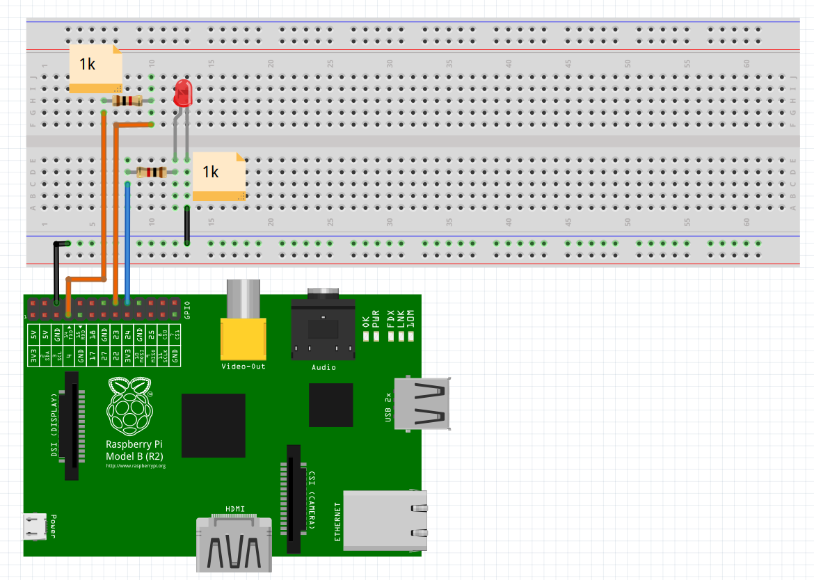

Simple program to demonstrate the generation of a clock signal on a General Purpose Input/Output (GPIO)
pin and the use of that clock signal for toggling the state of an LED.

Build the circuit, the LED should cycle between 10 seconds on and 10 seconds off.

