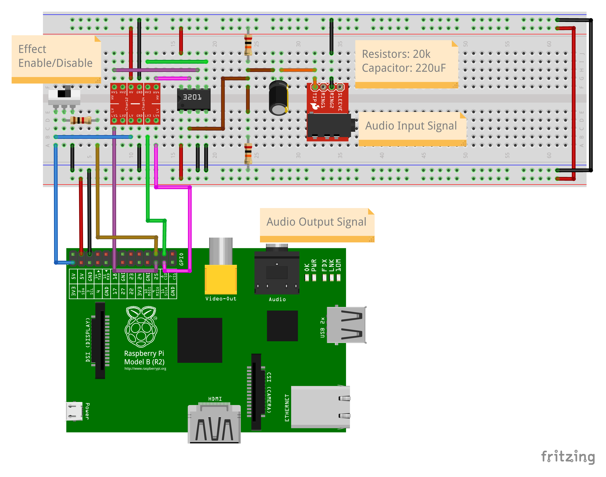

Simple program to sample analog audio from an SPI connected MCP3201 12-bit ADC, apply a reverb audio effect, and output
the processed audio to the Raspberry Pi's headphone jack

Usage
-----

1. Assemble the circuit as follows:

2. Audio received on the MCP3201 ADC will be played on the Raspberry Pi's headphone jack when the effect switch is enabled

Demo
----

#### Passthrough (D Major Pentatonic Scale)

[passthrough.webm](https://github.com/user-attachments/assets/8f862cd1-8fc4-4bcc-a3ff-97ba7040fa4a)

#### Reverb Effect Enabled (D Major Pentatonic Scale)

[reverb.webm](https://github.com/user-attachments/assets/821debc6-2c12-4654-be35-239aed281fa8)
