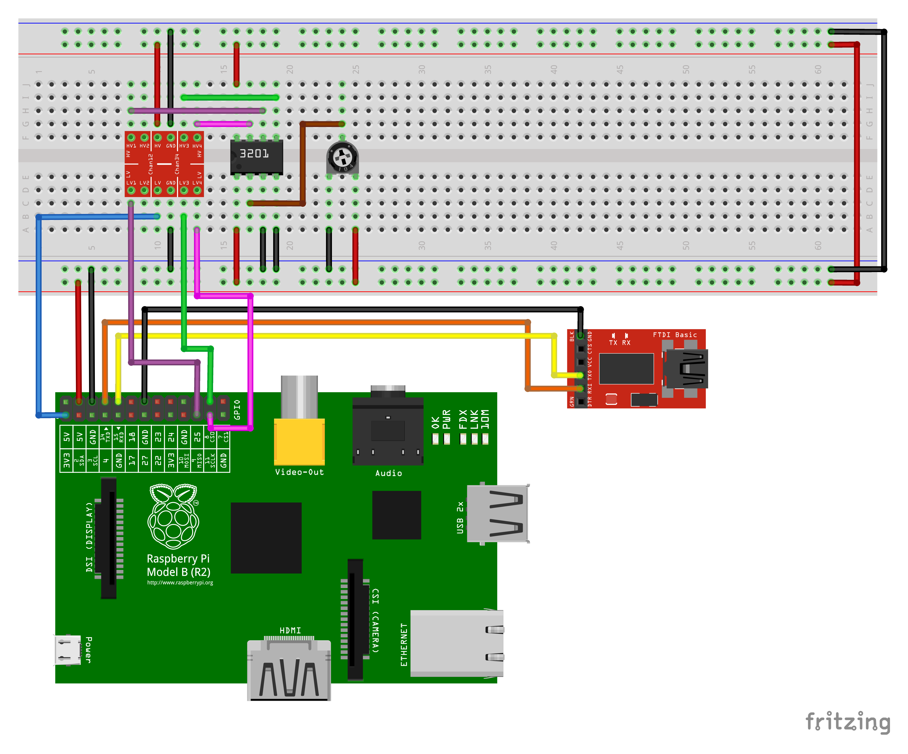

Simple program to test reading from an SPI connected MCP3201 12-bit ADC

Usage
-----

1. Connect the MCP3201 to the SPI interface of the Raspberry Pi via 5v to 3v3 level converter and connect
the MCP3201 to an analog potentiometer that will create a varying voltage between 0V and 5V.

2. Connect a USB to 3v3 TTL UART adapter to the UART pins on the Raspberry Pi and open a serial console at 115200 baud

3. Press any key at the prompt to perform one reading of the analog input voltage measured by the MCP3201 ADC

4. Adjust the potentiometer and verify that the sampled analog signal value varies accordingly with the value set by the potentiometer
